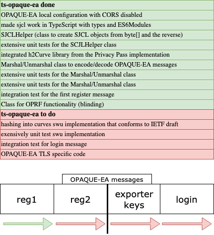

# TS-OPAQUE-EA
This project builds on [OPAQUE_EA](https://github.com/cloudflare/opaque-ea) by Tatiana Bradley and Sofía Celi.




##  Set up & Run Tests
Note: in order to run all the integration tests, you need a local OPAQUE-EA instance running. Check out my forked repo, for a configuration that runs locally [here](https://github.zhaw.ch/steigpa1/ba-opaque).

```sh
  # Change to ts dir
  cd ts-opaque-ea
  # Install dependencies
  npm i
  # Run tests
  npx jest
```
